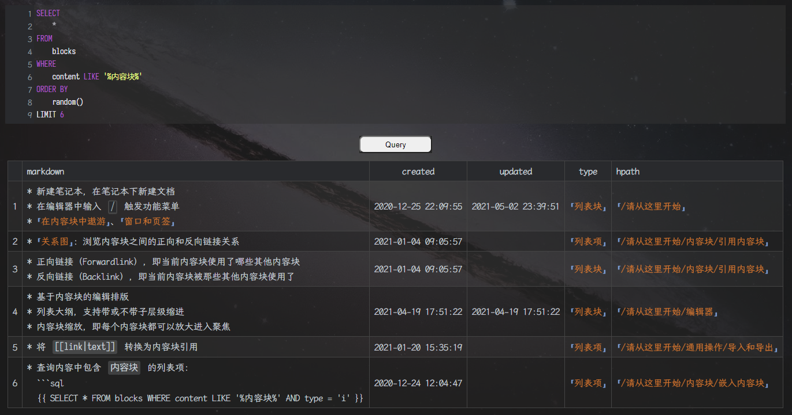

# widget-query

<center>

[](https://github.com/Zuoqiu-Yingyi/widget-query/releases/latest)
[](https://github.com/Zuoqiu-Yingyi/widget-query/releases/latest)
[](https://github.com/Zuoqiu-Yingyi/widget-query/blob/main/LICENSE)
[](https://github.com/Zuoqiu-Yingyi/widget-query/commits/main)


[](https://github.com/Zuoqiu-Yingyi/widget-query/releases)<!-- ALL-CONTRIBUTORS-BADGE:START - Do not remove or modify this section -->
[](#贡献者--contributor)
<!-- ALL-CONTRIBUTORS-BADGE:END -->

</center>

一个将思源笔记数据库查询结果以表格样式渲染的挂件  
A widget that renders the query results of the Siyuan Notes database in tabular style.

现已上架[思源笔记社区集市](https://github.com/siyuan-note/bazaar), 如果您需要订阅[思源笔记](https://github.com/siyuan-note/siyuan)增值服务，欢迎使用我的推荐码: **h0sc9rc**  
It is now on the shelves of the [Siyuan Notes Community Bazaar](https://github.com/siyuan-note/bazaar). If you need to subscribe to the value-added services of [siyuan note](https://github.com/siyuan-note/siyuan/blob/master/README_en_US.md), please use my referral code: **h0sc9rc**

## 预览 | PREVIEW



## 功能 | FUNCTION

1. 符合正则表达式 `^\s*SELECT\s+\*\s+FROM\s+blocks.*` 的 SQL 语句将启用自定义渲染模式  
   SQL statements that conform to the regular expression `^\s*SELECT\s+\*\s+FROM\s+blocks.*` will enable custom rendering mode.
   - 这个正则表达式在 `/src/script/module/config.js` 中的 `config.query.regs.blocks` 配置  
     This regular expression is configured in `config.query.regs.blocks` in `/src/script/module/config.js`
2. 自定义渲染模式 | Custom rendering modes
   - 可以在 `config.query.limit` 中设置过长查询结果的截取方案  
     You can set the the interception scheme for query results that are too long in `config.query.limit`.
     - `config.query.maxlen`: 最大长度 | Maximum length
     - `config.query.maxrow`: 最多行数 | Maximum number of rows
   - 可以在 `config.query.fields` 中设置想要显示的字段  
     You can set the fields you want to display in `config.query.fields`.
   - 可以在 `config.query.align` 中设置各字段的对齐方式  
     You can set the alignment of each field in `config.query.align`.
   - 可以在 `config.query.handler` 中设置各字段的处理方法  
     You can set the handling method for each field in `config.query.handler`.
3. 部分模板字段解析支持  
   Partial template field parsing support.
   - `.prefix{.field}`
     - `prefix`: 前缀字段 | prefix field
       - `block`: 挂件块 | Widget block.
       - `parent`: 挂件块的上级块 | The parent block of the pendant block.
       - `root`: 挂件块所在文档块 | The document block in which the pendant block resides.
     - `field`: 属性字段 | attribute field
       - 数据库中 `blocks` 表的字段名  
         The field name of the `blocks` table in the database.
4. 普通模式 | Normal mode
   - 使用字段别名前缀定义查询显示样式  
     Use field aliases prefix to define query display styles.
     - `__ref__`:
       - 该字段渲染为块引用  
         The field is rendered as a block reference.
       - 示例 | example: `((<field> "<field>"))`
     - `__link__`:
       - 该字段渲染为块链接  
         The field is rendered as a block link.
       - 示例 | example: `[<field>](<field>)`
     - `__raw__`:
       - 该字段渲染为原始值(行内代码样式)  
         The field is rendered as the original value (inline code style).
       - 示例 | example: `` `<field>` ``
     - `__date__`:
       - 该字段渲染为日期  
         The field is rendered as a date.
       - 示例 | example: `yyyy-MM-dd`
     - `__time__`:
       - 该字段渲染为时间  
         The field is rendered as a time.
       - 示例 | example: `HH:mm:ss`
     - `__datetime__`:
       - 该字段渲染为日期时间  
         The field is rendered as a datetime.
       - 示例 | example: `yyyy-MM-dd HH:mm:ss`
     - `__pre__`:
       - 该字段渲染为预览(渲染 markdown 行级标识符)  
         The field is rendered as a preview (rendering the markdown row-level identifier).
   - 默认显示查询结果原始值(使用行内代码)  
     Displays the original value of the query result by default (using inline code).

## 自定义配置 | CUSTOM CONFIG

### 全局自定义配置 | GLOBAL CUSTOM CONFIG

1. 创建文件 `<工作空间>/data/widgets/custom.js`  
   Create a file `<workspace>/data/widgets/custom.js`
2. 在文件 `<工作空间>/data/widgets/custom.js` 中定义的值将覆盖 `<工作空间>/data/widgets/Query/src/script/module/config.js` 中对应的值  
   The value defined in file `<workspace>/data/widgets/custom.js` overwrites the corresponding value in file `<workspace>/data/widgets/Query/src/script/module/config.js`.

#### 配置示例 | CONFIG EXAMPLE

```js
/* 路径 | Path
 * <工作空间>/data/widgets/custom.js
 * <workspace>/data/widgets/custom.js
 */

import {
    cutString,
    ReplaceSpace,
    ReplaceCRLF,
    ialParser,
    markdown2span,
    dateFormat,
    timeFormat,
    timestampFormat,
    isEmptyString,
} from '/widgets/Query/src/script/utils/string.js';

import {
    templateParse
} from '/widgets/Query/src/script/utils/templateParser.js'

export var config = {
    token: '', // API token, 无需填写
    query: { // 查询配置
        width: '128px', // 挂件宽度
        height: '32px', // 挂件高度
        radius: '8px', // 挂件圆角
        prefix: {
            // 非默认查询时字段别名前缀
            ref: '__ref__', // 该字段渲染为引用
            link: '__link__', // 该字段渲染为链接
            pre: '__pre__', // 该字段渲染为预览
            raw: '__raw__', // 该字段渲染为原始值
            date: '__date__', // 该字段渲染为日期
            time: '__time__', // 该字段渲染为时间
            datetime: '__datetime__', // 该字段渲染为日期时间
        },
        attribute: { // 块属性
            code: 'query-code', // 查询代码块
            widget: 'query-widget', // 查询挂件块
            table: 'query-table', // 查询结果表格块
        },
        regs: {
            blocks: /^\s*SELECT\s+\*\s+FROM\s+blocks.*/i, // 块查询的正则表达式
            limit: /\s+LIMIT\s+/i, // SQL LIMIT 关键字正则表达式
        },
        sql: {
            // SQL 语句处理
            limit: { // 查询记录数量限制, 若启用且为设置 LIMIT 语句, 则在查询语句末尾添加 "LIMIT begin, end"
                enable: false, // 是否启用限制
                begin: 0, // 开始记录数
                end: 100, // 结束记录数
            },
        },
        maxlen: 64, // 查询结果每个字段最大长度
        maxrow: 3, // 查询结果每个字段最大行数
        limit: 'row', // 查询结果字段限制, (null 为不限制, 'len' 为限制长度, 'row' 为限制行数)
        CRLF: '<br />', // 换行符替换
        space: ' ', // 空白字符替换
        template: { // 类似模板字段解析支持, 类似 .prefix{.field}, 目前支持的有 .root{.<挂件所在文档块的字段名>} .parent{.<挂件上级块的字段名>} .block{挂件块的字段名}
            enable: true, // 是否启用模板解析
            handler: async (data) => { // 模板解析处理函数
                return await templateParse(data);
            }
        },
        default: {
            // 非块查询的处理模式
            name: (key) => { // 字段名称处理函数
                switch (true) {
                    case key.startsWith(config.query.prefix.ref):
                        return key.substr(config.query.prefix.ref.length);
                    case key.startsWith(config.query.prefix.link):
                        return key.substr(config.query.prefix.link.length);
                    case key.startsWith(config.query.prefix.pre):
                        return key.substr(config.query.prefix.pre.length);
                    case key.startsWith(config.query.prefix.date):
                        return key.substr(config.query.prefix.date.length);
                    case key.startsWith(config.query.prefix.time):
                        return key.substr(config.query.prefix.time.length);
                    case key.startsWith(config.query.prefix.datetime):
                        return key.substr(config.query.prefix.datetime.length);
                    case key.startsWith(config.query.prefix.raw):
                        return key.substr(config.query.prefix.raw.length);
                    default:
                        return key;
                }
            },
            handler: (row, key) => { // 其他查询结果默认处理方法, row 是查询结果的一条记录, key 是字段名
                switch (true) {
                    case key.startsWith(config.query.prefix.ref):
                        return `((${row[key]} "${row[key]}"))`;
                    case key.startsWith(config.query.prefix.link):
                        return `[${row[key]}](${row[key]})`;
                    case key.startsWith(config.query.prefix.pre):
                        return markdown2span(row[key]);
                    case key.startsWith(config.query.prefix.date):
                        return dateFormat(row[key]);
                    case key.startsWith(config.query.prefix.time):
                        return timeFormat(row[key]);
                    case key.startsWith(config.query.prefix.datetime):
                        return timestampFormat(row[key]);
                    case key.startsWith(config.query.prefix.raw):
                    default:
                        return `\`${row[key]}\``;
                }
            },
            style: {
                column: '',
                align: ':-',
            },
        },
        fields: [ // 需渲染的 blocks 表的字段, 顺序分先后
            'type', // 内容块类型，参考((20210210103523-ombf290 "类型字段"))
            // 'content', // 去除了 Markdown 标记符的文本
            'markdown', // 包含完整 Markdown 标记符的文本
            'hpath', // 人类可读的内容块所在文档路径
            'created', // 创建时间
            'updated', // 更新时间

            // 'id', // 内容块 ID
            // 'parent_id', // 双亲块 ID, 如果内容块是文档块则该字段为空
            // 'root_id', // 文档块 ID
            // 'box', // 笔记本 ID
            // 'path', // 内容块所在文档路径
            // 'name', // 内容块名称
            // 'alias', // 内容块别名
            // 'memo', // 内容块备注
            // 'hash', // content 字段的 SHA256 校验和
            // 'length', // markdown 字段文本长度
            // 'subtype', // 内容块子类型，参考((20210210103411-tcbcjja "子类型字段"))
            // 'ial', // 内联属性列表，形如 `{: name="value"}`
            // 'sort', // 排序权重, 数值越小排序越靠前
        ],
        style: {
            // 查询结果样式
            column: {
                // 列样式, 自定义宽度的字段可以设置为 '{: style="width: 512px"}'
                content: '',
                markdown: '',
                created: '',
                updated: '',
                type: '',
                hpath: '',

                id: '',
                parent_id: '',
                root_id: '',
                hash: '',
                box: '',
                path: '',
                name: '',
                alias: '',
                memo: '',
                length: '',
                subtype: '',
                ial: '',
                sort: '',
            },
            align: { // 查询结果字段对齐样式(':-' 左对齐, ':-:' 居中, '-:' 右对齐)
                content: ':-',
                markdown: ':-',
                created: ':-:',
                updated: ':-:',
                type: ':-:',
                hpath: ':-',

                id: ':-:',
                parent_id: ':-:',
                root_id: ':-:',
                hash: ':-:',
                box: ':-:',
                path: ':-',
                name: ':-',
                alias: ':-',
                memo: ':-',
                length: '-:',
                subtype: '-:',
                ial: ':-',
                sort: '-:',
            },
        },
        filter: {
            // 查询结果过滤器
            blocks: { // 块查询的过滤
                enable: true, // 是否启用过滤
                handlers: [ // 过滤处理方法序列
                    (row, data) => { // 过滤查询结果中的查询结构(查询代码块, Query 挂件块)
                        // row: 查询结果一条记录
                        // data: 挂件数据
                        // return: 返回 true 则过滤掉当前记录, 返回 false 则不过滤
                        switch (true) {
                            case row.ial.indexOf(`custom-type="${data.config.query.attribute.code}"`) != -1:
                            case row.ial.indexOf(`custom-type="${data.config.query.attribute.widget}"`) != -1:
                            case row.ial.indexOf(`custom-type="${data.config.query.attribute.table}"`) != -1:
                                return true;
                            default:
                                return false;
                        }
                    },
                ],
            }
        },
        handler: { // 块查询结果各字段处理方法
            content: (row) => {
                switch (config.query.limit) {
                    case 'len':
                        return markdown2span(cutString(ReplaceSpace(row.content, config.query.space), config.query.maxlen));
                    case 'row':
                        return markdown2span(ReplaceCRLF(cutString(row.content, undefined, config.query.maxrow), config.query.CRLF));
                    default:
                        return markdown2span(row.content);
                }
            },
            markdown: (row) => {
                switch (config.query.limit) {
                    case 'len':
                        return markdown2span(cutString(ReplaceSpace(row.markdown, config.query.space), config.query.maxlen));
                    case 'row':
                        return markdown2span(ReplaceCRLF(cutString(row.markdown, undefined, config.query.maxrow), config.query.CRLF));
                    default:
                        return markdown2span(row.markdown);
                }
            },
            created: (row) => {
                return timestampFormat(row.created);
            },
            updated: (row) => {
                return timestampFormat(row.updated);
            },
            type: (row) => {
                return `((${row.id} "${config.query.map.blocktype[row.type]}"))`;
            },
            hpath: (row) => {
                return `((${row.root_id} "${row.hpath}"))`;
            },

            id: (row) => {
                return `((${row.id} "${row.id}"))`;
            },
            parent_id: (row) => {
                if (isEmptyString(row.parent_id)) return '';
                else return `((${row.parent_id} "${row.parent_id}"))`;
            },
            root_id: (row) => {
                return `((${row.root_id} "${row.root_id}"))`;
            },
            hash: (row) => {
                return `\`${row.hash}\``;
            },
            box: (row) => {
                return `\`${row.box}\``;
            },
            path: (row) => {
                return `\`${row.path}\``;
            },
            name: (row) => {
                return markdown2span(row.name);
            },
            alias: (row) => {
                return markdown2span(row.alias);
            },
            memo: (row) => {
                return markdown2span(row.memo);
            },
            length: (row) => {
                return row.length;
            },
            subtype: (row) => {
                return config.query.map.subtype[row.subtype];
            },
            ial: (row) => {
                let ial = ialParser(row.ial);
                let ial_markdown = [];
                for (let key of Object.keys(ial)) {
                    switch (key) {
                        case 'id':
                        case 'updated':
                            continue;
                        case 'icon':
                            ial_markdown.push(`\`${key}\`\: :${ial[key].replace(/\.\w+$/, '')}:`);
                            break;
                        default:
                            ial_markdown.push(`\`${key}\`\: \`${ial[key]}\``);
                            break;
                    }
                }
                return ial_markdown.join(config.query.CRLF);
            },
            sort: (row) => {
                return row.sort;
            },
        },
        map: {
            // 映射表
            blocktype: { // 块类型映射
                d: '文档块',
                h: '标题块',
                l: '列表块',
                i: '列表项',
                c: '代码块',
                m: '公式块',
                t: '表格块',
                b: '引述块',
                s: '超级块',
                p: '段落块',
                tb: '分隔线',
                video: '视频块',
                audio: '音频块',
                widget: '挂件块',
                iframe: 'iframe',
                query_embed: '嵌入块',
                '': '',
                null: '',
                undefined: '',
            },
            subtype: { // 子类型映射
                o: '有序列表',
                u: '无序列表',
                t: '任务列表',
                h1: '一级标题',
                h2: '二级标题',
                h3: '三级标题',
                h4: '四级标题',
                h5: '五级标题',
                h6: '六级标题',
                '': '',
                null: '',
                undefined: '',
            },
        },
    },
};

```

### 块自定义配置 | BLOCK CUSTOM CONFIG

- 在挂件块（笔记中的Query按钮）中设置自定义块属性  
  Set custom block attributes in the widget block(the Query button in your note).
  - 自定义属性名称为 `src/script/module/config.js` 文件中 `config` 对象中的属性  
    Custom block attribute names are property in the `config` object under the file `src/script/module/config.js`.
  - 例如, 如果想要自定义查询结果字段列表, 可以设置自定义块属性 `query-fields`: `["hpath", "type", "markdown"]`, 在该块中将会替换 `config.query.fields` 字段  
    For example, if you want to customize the query result field list, you can set the custom block attribute `query-fields`: `["hpath", "type", "markdown"]`, where the `config.query.fields` property will be replaced in this block.

## 开始 | START

该挂件已在[思源笔记社区集市](https://github.com/siyuan-note/bazaar)上架, 可直接在集市中安装  
The widget has been put on the shelves at [SiYuan community bazaar](https://github.com/siyuan-note/bazaar) and can be installed directly in the Bazaar.

## 参考 & 感谢 | REFERENCE & THANKS

| 作者 \| Author                                      | 项目 \| Project                                                                                                                                       | 许可证 \| License |
| :-------------------------------------------------- | :---------------------------------------------------------------------------------------------------------------------------------------------------- | :---------------- |
| **[leolee9086](https://github.com/leolee9086)**     | [leolee9086/cc-baselib](https://github.com/leolee9086/cc-baselib)                                                                                     | *Unknown*         |

注: 排序不分先后  
ps: Sort in no particular order.

## 贡献者 | CONTRIBUTOR

<!-- [](https://github.com/Zuoqiu-Yingyi/widget-query/graphs/contributors) -->

<!-- ALL-CONTRIBUTORS-LIST:START - Do not remove or modify this section -->
<!-- prettier-ignore-start -->
<!-- markdownlint-disable -->
<table>
  <tr>
    <td align="center"><a href="https://github.com/leolee9086"><br /><sub><b>leolee9086</b></sub></a><br /><a href="https://github.com/Zuoqiu-Yingyi/widget-query/issues?q=author%3Aleolee9086" title="Bug reports">🐛</a> <a href="https://github.com/Zuoqiu-Yingyi/widget-query/commits?author=leolee9086" title="Code">💻</a></td>
    <td align="center"><a href="https://github.com/jpanda-cn"><br /><sub><b>jpanda-cn</b></sub></a><br /><a href="https://github.com/Zuoqiu-Yingyi/widget-query/commits?author=jpanda-cn" title="Code">💻</a></td>
    <td align="center"><a href="https://www.cnblogs.com/duanguyuan/"><br /><sub><b>Wang Yong</b></sub></a><br /><a href="https://github.com/Zuoqiu-Yingyi/widget-query/commits?author=whuwangyong" title="Documentation">📖</a></td>
    <td align="center"><a href="https://github.com/banjuer"><br /><sub><b>banjuer</b></sub></a><br /><a href="#ideas-banjuer" title="Ideas, Planning, & Feedback">🤔</a></td>
  </tr>
</table>

<!-- markdownlint-restore -->
<!-- prettier-ignore-end -->

<!-- ALL-CONTRIBUTORS-LIST:END -->

注: 该表格使用 [All Contributors · GitHub](https://github.com/all-contributors) 自动生成, 请到 [emoji key](https://allcontributors.org/docs/en/emoji-key) 查看贡献类型   
ps: The table is generated automatically using [All Contributors · GitHub](https://github.com/all-contributors), go to [emoji key](https://allcontributors.org/docs/en/emoji-key) to see the contribution type.

## 更改日志 | CHANGE LOG

[CHANGE LOG](./CHANGELOG.md)
