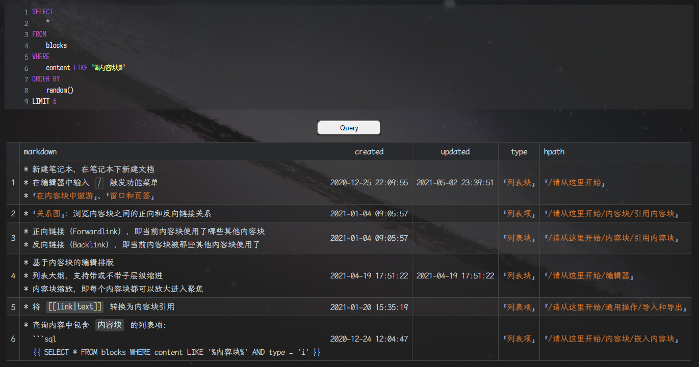
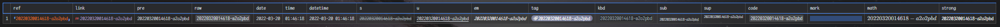

<div align="center">


[](https://github.com/Zuoqiu-Yingyi/widget-query/releases/latest)
[](https://github.com/Zuoqiu-Yingyi/widget-query/releases/latest)
[](https://github.com/Zuoqiu-Yingyi/widget-query/blob/main/LICENSE)
[](https://github.com/Zuoqiu-Yingyi/widget-query/commits/main)


[](https://github.com/Zuoqiu-Yingyi/widget-query/releases)<!-- ALL-CONTRIBUTORS-BADGE:START - Do not remove or modify this section -->
[](#contributors)
<!-- ALL-CONTRIBUTORS-BADGE:END -->

---
简体中文 \| [English](./README.md)

</div>

---
# widget-query

一个将思源笔记数据库查询结果以表格样式渲染的挂件

现已上架[思源笔记社区集市](https://github.com/siyuan-note/bazaar), 如果您喜欢本挂件, 欢迎为本项目点亮一个⭐!

思源数据库表与字段详情请见: [思源数据库表与字段 · 语雀](https://www.yuque.com/siyuannote/docs/go7uom)

## 预览



背景颜色状态指示:

* 白色:

  * 初始化
  * 正在处理查询
* 绿色

  * 查询成功
* 蓝色

  * 请继续操作
* 黄色

  * 查询结果为空
* 红色

  * SQL 语句错误
  * 未知错误

## 功能

1. 点选自动查询复选框, 下次打开该页面时自动进行一次查询
2. 为挂件块设置自定义属性 <kbd>input</kbd> 可以指定某个代码块或嵌入块中的 SQL 语句作为查询语句

    * 例如在其他文档中有一个代码块或嵌入块 ID 为 `20220418210605-ibussa1`, 那么为挂件块设置自定义块属性 <kbd>input</kbd>: `20220418210605-ibussa1` 可以引用该块的 SQL 语句进行查询
    * 只有挂件块前一个块不是具有自定义属性 <kbd>type</kbd>: `query-code` 的代码块时才会触发
2. 为挂件块设置自定义属性 <kbd>output</kbd> 可以指定某个表格块作为查询结果展示块

    * 例如在其他文档中有一个表格块 ID 为 `20220604112815-sfiwyi7`, 那么为挂件块设置自定义块属性 <kbd>output</kbd>: `20220604112815-sfiwyi7` 可以将查询结果渲染到该表格中
    * 只有挂件块后一个块不是具有自定义属性 <kbd>type</kbd>: `query-table` 的表格块时才会触发
3. 符合正则表达式 `^\s*SELECT\s+\*\s+FROM\s+blocks\s+.*` 的 SQL 语句将启用<kbd>默认块查询模式</kbd>

    * 该正则表达式在 `/src/script/module/config.js` 文件中 `config.query.regs.blocks` 定义
    * 示例: `SELECT * FROM blocks WHERE content LIKE '%内容块%'`
    * 该模式下, 查询结果渲染样式将以如下配置选项进行控制

      | 字段                                    | 字段说明                                                                                                                                                        | 字段值                                                            | 字段值说明                                                                       |
      | --------------------------------------- | --------------------------------------------------------------------------------------------------------------------------------------------------------------- | ----------------------------------------------------------------- | -------------------------------------------------------------------------------- |
      | `config.query.render.*`                 | 定义部分字段渲染样式<br />超链接样式形如 `[锚文本](siyuan://blocks/<块ID>)`, 不会显示在反链面板中<br />块引用样式形如 `((<块ID> "锚文本"))`, 会显示在反面面板中 | `'link'`<br />`'ref'`                                             | 以超链接形式渲染字段<br />以块引用形式渲染字段                                   |
      | `config.query.render.ial.shape`         | 定义块属性列表 `IAL` 排列方式<br />一列中分行显示<br />一行中分列显示<br />                                                                                     | `'rows'`<br />`'columns'`                                         |                                                                                  |
      | `config.query.render.ial.fields.forced` | 定义强制渲染的 `IAL` 属性名, 若为空数组则使用黑白名单控制                                                                                                       | `['属性名', ...]`                                                 |                                                                                  |
      | `config.query.render.ial.fields.ignore` | 定义不渲染的 `IAL` 属性名(黑名单), 优先级比白名单高                                                                                                             | `['属性名', ...]`                                                 |                                                                                  |
      | `config.query.render.ial.fields.ignore` | 定义可渲染的 `IAL` 属性名(白名单), 若为空则渲染黑名单外的所有字段                                                                                               | `['属性名', ...]`                                                 |                                                                                  |
      | `config.query.limit`                    | 定义 `content` 或 `markdown` 字段查询结果显示样式                                                                                                               | `null`<br />`'row'`<br />`'len'`<br />                            | 无限制<br />限制行数<br />限制长度                                               |
      | `config.query.maxlen`                   | 定义 `content` 或 `markdown` 字段查询结果最大长度<br />                                                                                                         | 正整数                                                            | `config.query.limit: 'len'` 时启用                                               |
      | `config.query.maxrow`                   | 定义 `content` 或 `markdown` 字段查询结果最大行数<br />                                                                                                         | 正整数                                                            | `config.query.limit: 'row'` 时启用                                               |
      | `config.query.fields`                   | 定义查询结果需要显示的字段与字段排列顺序                                                                                                                        | `['字段名', ...]`                                                 | 字段名详情请参考 [blocks](https://www.yuque.com/siyuannote/docs/go7uom#276bd8cf) |
      | `config.query.style.table.attributes`   | 定义查询结果表格的块属性, 可用于设置自定义样式                                                                                                                  | `[{enable: true/false, key: '块属性名', value: '块属性值'}, ...]` |                                                                                  |
      | `config.query.style.column.*`           | 定义查询结果表格某一列的样式                                                                                                                                    | `{: style="width: 512px"}`                                        | 指定查询结果某一列的宽度                                                         |
      | `config.query.style.align.*`            | 定义查询结果表格某一列的对齐方式                                                                                                                                | `:-`<br />`:-:`<br />`-:`                                         | 左对齐<br />居中<br />右对齐                                                     |
      | `config.query.filter.blocks`            | 定义过滤器序列, 过滤一些查询结果                                                                                                                                | `{enable: true/flase, handlers: [(row, data) => {}, ...]}`        | 需要过滤的返回 `true`, 需要保留的返回 `false`                                    |
      | `config.query.handler.*`                | 定义具体字段值的处理函数                                                                                                                                        | `(row, ial) => {}`                                                | `row`: 当前记录<br />`ial`: 当前查询记录解析后的内联属性列表                     |
      | `config.query.map.*`                    | 查询结果映射表, 将某些查询结果字段值替换为人类可读的字段                                                                                                        |                                                                   |                                                                                  |
4. 不符合<kbd>默认块查询模式</kbd>的查询均为<kbd>普通查询模式</kbd>

    * 示例

      * 查询帮助文档 `请从这里开始` 及其下级所有的文档

        ```sql
        SELECT
            '[' || b.content || '](siyuan://blocks/' || b.id || ')' AS __1____pre__文档标题,
            b.hpath AS __2__文档路径
        FROM
            blocks AS b
        WHERE
            b.type = 'd'
            AND b.hpath LIKE '%请从这里开始%'
        ORDER BY
            b.path
        LIMIT 10
        ```

        |      | 文档标题                                                       | 文档路径                                    |
        | ---: | :------------------------------------------------------------- | :------------------------------------------ |
        |    1 | [请从这里开始](siyuan://blocks/20200812220555-lj3enxa)         | `/请从这里开始`                             |
        |    2 | [编辑器](siyuan://blocks/20210808180320-abz7w6k)               | `/请从这里开始/编辑器`                      |
        |    3 | [排版元素](siyuan://blocks/20200825162036-4dx365o)             | `/请从这里开始/编辑器/排版元素`             |
        |    4 | [内容块](siyuan://blocks/20210808180320-fqgskfj)               | `/请从这里开始/内容块`                      |
        |    5 | [什么是内容块](siyuan://blocks/20200813004931-q4cu8na)         | `/请从这里开始/内容块/什么是内容块`         |
        |    6 | [引用内容块](siyuan://blocks/20200813013559-sgbzl5k)           | `/请从这里开始/内容块/引用内容块`           |
        |    7 | [在内容块中遨游](siyuan://blocks/20200813131152-0wk5akh)       | `/请从这里开始/内容块/在内容块中遨游`       |
        |    8 | [内容块类型](siyuan://blocks/20200905090211-2vixtlf)           | `/请从这里开始/内容块/内容块类型`           |
        |    9 | [嵌入内容块](siyuan://blocks/20201117101902-2ewjjum)           | `/请从这里开始/内容块/嵌入内容块`           |
        |   10 | [文档块和标题块的转换](siyuan://blocks/20201210103036-1x3vm8t) | `/请从这里开始/内容块/文档块和标题块的转换` |

      * 查询思源数据库所有表

        ```sql
        SELECT
            *
        FROM
            sqlite_master
        ```

        |      | name                   | rootpage | sql                                                                                                                                                              | tbl_name               | type    |
        | ---: | :--------------------- | :------- | :--------------------------------------------------------------------------------------------------------------------------------------------------------------- | :--------------------- | :------ |
        |    1 | `stat`                 | `2`      | `CREATE TABLE stat (key, value)`                                                                                                                                 | `stat`                 | `table` |
        |    2 | `blocks`               | `3`      | `CREATE TABLE blocks (id, parent_id, root_id, hash, box, path, hpath, name, alias, memo, content, markdown, length, type, subtype, ial, sort, created, updated)` | `blocks`               | `table` |
        |    3 | `spans`                | `4`      | `CREATE TABLE spans (id, block_id, root_id, box, path, content, markdown, type, ial)`                                                                            | `spans`                | `table` |
        |    4 | `assets`               | `5`      | `CREATE TABLE assets (id, block_id, root_id, box, docpath, path, name, title, hash)`                                                                             | `assets`               | `table` |
        |    5 | `attributes`           | `6`      | `CREATE TABLE attributes (id, name, value, type, block_id, root_id, box, path)`                                                                                  | `attributes`           | `table` |
        |    6 | `refs`                 | `7`      | `CREATE TABLE refs (id, def_block_id, def_block_parent_id, def_block_root_id, def_block_path, block_id, root_id, box, path, content, markdown, type)`            | `refs`                 | `table` |
        |    7 | `file_annotation_refs` | `8`      | `CREATE TABLE file_annotation_refs (id, file_path, annotation_id, block_id, root_id, box, path, content, type)`                                                  | `file_annotation_refs` | `table` |
      * 查询思源数据库 `blocks` 表中所有字段  

        ```sql
        PRAGMA table_info('blocks')
        ```

        |      | cid  | dflt_value | name        | notnull | pk   | type |
        | ---: | :--- | :--------- | :---------- | :------ | :--- | :--- |
        |    1 |      |            | `id`        |         |      |      |
        |    2 | `1`  |            | `parent_id` |         |      |      |
        |    3 | `2`  |            | `root_id`   |         |      |      |
        |    4 | `3`  |            | `hash`      |         |      |      |
        |    5 | `4`  |            | `box`       |         |      |      |
        |    6 | `5`  |            | `path`      |         |      |      |
        |    7 | `6`  |            | `hpath`     |         |      |      |
        |    8 | `7`  |            | `name`      |         |      |      |
        |    9 | `8`  |            | `alias`     |         |      |      |
        |   10 | `9`  |            | `memo`      |         |      |      |
        |   11 | `10` |            | `content`   |         |      |      |
        |   12 | `11` |            | `markdown`  |         |      |      |
        |   13 | `12` |            | `length`    |         |      |      |
        |   14 | `13` |            | `type`      |         |      |      |
        |   15 | `14` |            | `subtype`   |         |      |      |
        |   16 | `15` |            | `ial`       |         |      |      |
        |   17 | `16` |            | `sort`      |         |      |      |
        |   18 | `17` |            | `created`   |         |      |      |
        |   19 | `18` |            | `updated`   |         |      |      |
      * 自定义属性视图

        ```sql
        SELECT
            '[' || b.content || '](siyuan://blocks/' || a.block_id || ')' AS __1____pre__文档标题,
            MAX(
                CASE
                    WHEN a.name = 'name' THEN a.value
                    ELSE NULL
                END
            ) AS __2____kbd__命名,
            MAX(
                CASE
                    WHEN a.name = 'alias' THEN REPLACE(
                        '<kbd>' || a.value || '</kbd>',
                        ',',
                        '</kbd><br/><kbd>'
                    )
                    ELSE NULL
                END
            ) AS __3____pre__别名,
            MAX(
                CASE
                    WHEN a.name = 'memo' THEN REPLACE(
                        '<kbd>' || a.value || '</kbd>',
                        ',',
                        '</kbd><br/><kbd>'
                    )
                    ELSE NULL
                END
            ) AS __3____pre__备注
        FROM
            attributes AS a
            INNER JOIN blocks AS b ON a.block_id = b.id
        WHERE
            (
                a.name = 'name'
                OR a.name = 'alias'
                OR a.name = 'memo'
            )
            AND b.type = 'd'
        GROUP BY
            a.block_id
        ORDER BY
            RANDOM()
        LIMIT
            10;
        ```

          
    * 使用字段别名前缀定义查询显示样式

      * `__hidden__别名0`:

        * 该字段不显示在查询结果中
      * `__ref__别名1`:

        * 该字段渲染为块引用
        * 示例: `((<value> "<value>"))`
      * `__link__别名2`:

        * 该字段渲染为块链接
        * 示例: `[<value>](siyuan://blocks/<value>)`
      * `__raw__别名3`:

        * 该字段渲染为原始值(行内代码样式)
        * 示例: ``<value>``
      * `__date__别名4`:

        * 该字段渲染为日期
        * 示例: `yyyy-MM-dd`
      * `__time__别名5`:

        * 该字段渲染为时间
        * 示例: `HH:mm:ss`
      * `__datetime__别名6`:

        * 该字段渲染为日期时间
        * 示例: `yyyy-MM-dd HH:mm:ss`
      * `__s__别名7`:

        * 该字段渲染为删除线
        * 示例: `~~<value>~~`
      * `__u__别名8`:

        * 该字段渲染为下划线
        * 示例: `<u><value></u>`
      * `__em__别名9`:

        * 该字段渲染为斜体
        * 示例: `*<value>*`
      * `__tag__别名10`:

        * 该字段渲染为标签
        * 示例: `<kbd><value></kbd>`
      * `__kbd__别名11`:

        * 该字段渲染为按键样式
        * 示例: `~<value>~`
      * `__sub__别名12`:

        * 该字段渲染为下标样式
        * 示例: `^<value>^`
      * `__sup__别名13`:

        * 该字段渲染为上标样式
        * 示例: `#<value>#`
      * `__code__别名14`:

        * 该字段渲染为行内代码
        * 示例: ``<value>``
      * `__mark__别名15`:

        * 该字段渲染为标记
        * 示例: `==<value>==`
      * `__math__别名16`:

        * 该字段渲染为公式
        * 示例: `$<value>$`
      * `__strong__别名17`:

        * 该字段渲染为粗体
        * 示例: `**<value>**`
      * `__pre__别名18`:

        * 该字段渲染为预览(渲染 markdown 行级标识符)
        * 示例: `<value>`
    * 使用字段别名前缀定义查询结果字段顺序

      * `__<数字>__别名8`:

        * 该字段可以放置在查询样式前缀字段的前面
        * 示例:

          * `__1____pre__别名9`
          * `__02____raw__别名10`
    * 默认显示查询结果原始值(使用行内代码)
    * 字段别名前缀示例

      * ```sql
        SELECT
            b.id AS __00____ref__ref,
            b.id AS __01____link__link,
            b.id AS __02____pre__pre,
            b.id AS __03____raw__raw,
            b.created AS __04____date__date,
            b.created AS __05____time__time,
            b.created AS __06____datetime__datetime,
            b.id AS __07____s__s,
            b.id AS __08____u__u,
            b.id AS __09____em__em,
            b.id AS __10____tag__tag,
            b.id AS __11____kbd__kbd,
            b.id AS __12____sub__sub,
            b.id AS __13____sup__sup,
            b.id AS __14____code__code,
            b.id AS __15____mark__mark,
            b.id AS __16____math__math,
            b.id AS __17____strong__strong
        FROM
            blocks AS b
        WHERE
            id = '.root{.id}'
        ```

        
5. 部分模板字段解析支持

    * `.<prefix>{.<field>}`

      * `<prefix>`: 前缀字段

        * `block`: 挂件块
        * `parent`: 挂件块的上级块
        * `root`: 挂件块所在文档块
      * `<field>`: 属性字段

        * 数据库中 `blocks` 表的字段名, 详情请参考 [blocks](https://www.yuque.com/siyuannote/docs/go7uom#276bd8cf)
      * 示例: `SELECT * FROM blocks WHERE id = '.root{.id}' content LIKE '%内容块%'`

        * 等价于 `SELECT * FROM blocks WHERE id = '.block{.root_id}' content LIKE '%内容块%'`
        * 查询挂件所在文档中所有含有 `内容块` 三个字的块

## 自定义配置

### 全局自定义配置

1. 创建文件 `<工作空间>/data/widgets/custom.js`
2. 在文件 `<工作空间>/data/widgets/custom.js` 中定义的值将覆盖 `<工作空间>/data/widgets/Query/src/script/module/config.js` 中对应的值

#### 配置示例

```js
/**
 * 文件路径
 *    <工作空间>/data/widgets/custom.js
 * 示例功能 | Example function:
 *    默认块查询结果中将块属性分列显示
 */

export const config = {
    query: {
        render: {
            ial: {
                shape: 'columns',
            },
        },
    },
};

```

更多配置项请参考 [config.js](./src/script/module/config.js)

### 块自定义配置

* 在挂件块（笔记中的Query按钮）中设置自定义块属性

  * 自定义属性名称为 `src/script/module/config.js` 文件中 `config` 对象中的属性
  * 例如, 如果想要自定义查询结果字段列表, 可以设置自定义块属性 `query-fields`: `["hpath", "type", "markdown"]`, 在该块中将会替换 `config.query.fields` 字段

## 开始

该挂件已在[思源笔记社区集市](https://github.com/siyuan-note/bazaar)上架, 可直接在集市中安装

## 参考 & 感谢

| 作者                                            | 项目                                                              | 许可证    |
| :---------------------------------------------- | :---------------------------------------------------------------- | :-------- |
| **[leolee9086](https://github.com/leolee9086)** | [leolee9086/cc-baselib](https://github.com/leolee9086/cc-baselib) | *Unknown* |

注: 排序不分先后

## CONTRIBUTORS

<!-- [](https://github.com/Zuoqiu-Yingyi/widget-query/graphs/contributors) -->

<!-- ALL-CONTRIBUTORS-LIST:START - Do not remove or modify this section -->
<!-- prettier-ignore-start -->
<!-- markdownlint-disable -->
<table>
  <tbody>
    <tr>
      <td align="center" valign="top" width="14.28%"><a href="https://github.com/leolee9086"><br /><sub><b>leolee9086</b></sub></a><br /><a href="https://github.com/Zuoqiu-Yingyi/widget-query/issues?q=author%3Aleolee9086" title="Bug reports">🐛</a> <a href="https://github.com/Zuoqiu-Yingyi/widget-query/commits?author=leolee9086" title="Code">💻</a></td>
      <td align="center" valign="top" width="14.28%"><a href="https://github.com/jpanda-cn"><br /><sub><b>jpanda-cn</b></sub></a><br /><a href="https://github.com/Zuoqiu-Yingyi/widget-query/commits?author=jpanda-cn" title="Code">💻</a> <a href="#ideas-jpanda-cn" title="Ideas, Planning, & Feedback">🤔</a></td>
      <td align="center" valign="top" width="14.28%"><a href="https://www.cnblogs.com/duanguyuan/"><br /><sub><b>Wang Yong</b></sub></a><br /><a href="https://github.com/Zuoqiu-Yingyi/widget-query/commits?author=whuwangyong" title="Documentation">📖</a></td>
      <td align="center" valign="top" width="14.28%"><a href="https://github.com/banjuer"><br /><sub><b>banjuer</b></sub></a><br /><a href="#ideas-banjuer" title="Ideas, Planning, & Feedback">🤔</a></td>
      <td align="center" valign="top" width="14.28%"><a href="https://github.com/Tlonglan"><br /><sub><b>Tlonglan</b></sub></a><br /><a href="#ideas-Tlonglan" title="Ideas, Planning, & Feedback">🤔</a></td>
      <td align="center" valign="top" width="14.28%"><a href="https://git.io/k.r"><br /><sub><b>Tim Zhang</b></sub></a><br /><a href="#ideas-ttimasdf" title="Ideas, Planning, & Feedback">🤔</a> <a href="https://github.com/Zuoqiu-Yingyi/widget-query/commits?author=ttimasdf" title="Code">💻</a></td>
      <td align="center" valign="top" width="14.28%"><a href="https://github.com/lmmxj"><br /><sub><b>lmmxj</b></sub></a><br /><a href="#ideas-lmmxj" title="Ideas, Planning, & Feedback">🤔</a></td>
    </tr>
    <tr>
      <td align="center" valign="top" width="14.28%"><a href="https://github.com/frostime"><br /><sub><b>Frostime</b></sub></a><br /><a href="https://github.com/Zuoqiu-Yingyi/widget-query/commits?author=frostime" title="Code">💻</a></td>
    </tr>
  </tbody>
</table>

<!-- markdownlint-restore -->
<!-- prettier-ignore-end -->

<!-- ALL-CONTRIBUTORS-LIST:END -->

注: 该表格使用 [All Contributors · GitHub](https://github.com/all-contributors) 自动生成, 请到 [emoji key](https://allcontributors.org/docs/en/emoji-key) 查看贡献类型

## 更改日志

[CHANGE LOG](./CHANGELOG.md)
